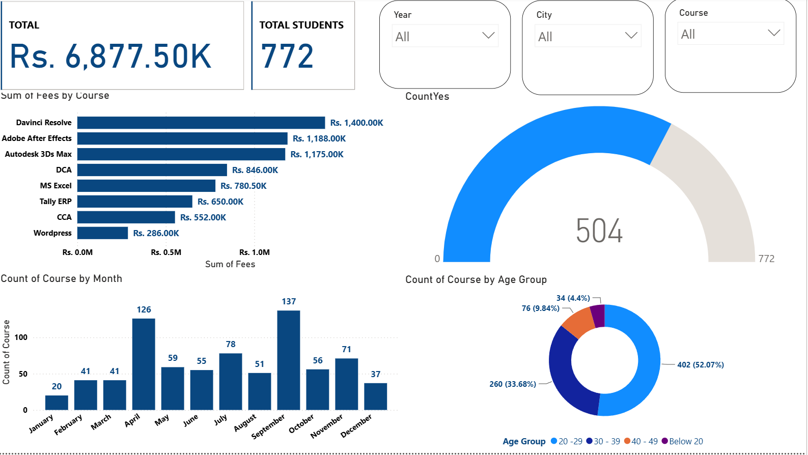
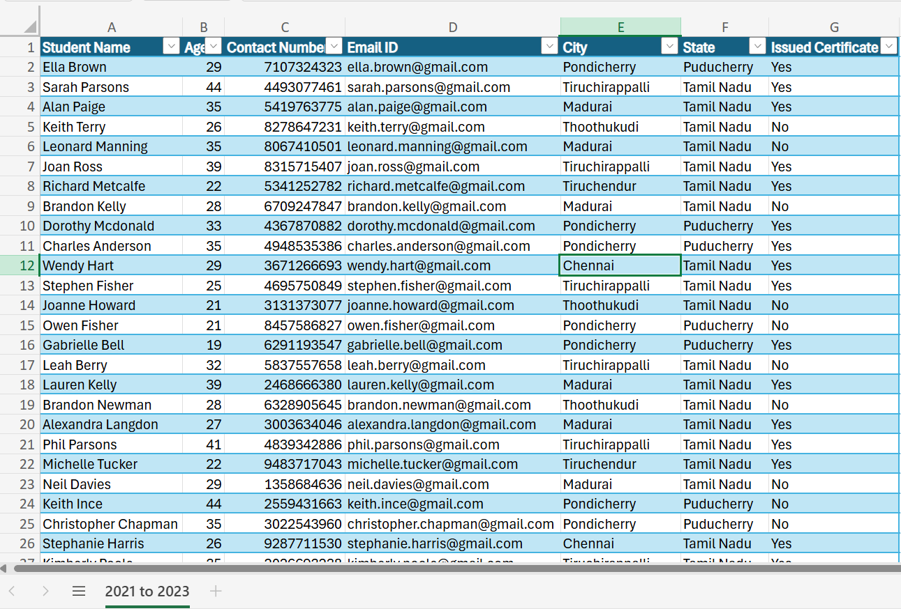

🎓 ABC Institute – Power BI Dashboard

Interactive Student Enrollment and Course Fee Analysis

⸻

📌 Project Overview

The ABC Institute Power BI Dashboard is an interactive data analysis project created to examine student enrollment, course fees, age groups, monthly admissions, and course performance.

The project uses student information stored in Microsoft Excel. The data was cleaned and transformed before being visualized in Microsoft Power BI.

The dashboard helps users quickly understand the institute’s overall performance and explore the information using interactive filters.

⸻

📊 Dashboard Preview

The dashboard displays important key performance indicators, charts, comparisons, and filters in one interactive report.

  

⸻

📁 Source Data Preview

The original dataset was prepared in Microsoft Excel and contains student records from 2021 to 2023.

  

The dataset includes the following information:

Column	Description
Student Name	Name of the enrolled student
Age	Student’s age
Contact Number	Student’s contact information
Email ID	Student’s email address
City	Student’s city
State	Student’s state
Course	Course selected by the student
Fees	Fee paid for the selected course
Year	Student enrollment year
Issued Certificate	Whether the certificate was issued

The image above displays only a sample of the Excel dataset used for this project.

⸻

📈 Dashboard Highlights

Metric	Value
💰 Total Course Fees	Rs. 6,877.50K
👨‍🎓 Total Students	772
🏆 Highest Enrollment Month	September
🎯 Largest Age Group	20–29
📚 Highest Fee-Generating Course	DaVinci Resolve

⸻

✨ Dashboard Features

* Interactive Power BI dashboard
* Total student KPI card
* Total course fees KPI card
* Course fee performance analysis
* Monthly student enrollment analysis
* Student age-group distribution
* Country-based progress gauge
* Year, city, and course slicers
* Dynamic filtering across dashboard visuals
* Clean and user-friendly report design

⸻

🎛️ Interactive Filters

The dashboard contains the following slicers:

* Year – Filter student records by enrollment year
* City – View information for a selected city
* Course – Analyze the performance of a particular course

Selecting a value from any slicer automatically updates the connected charts and KPI cards.

⸻

📊 Dashboard Visualizations

💰 Course Fee Analysis

The horizontal bar chart compares the total fees collected from different courses.

The analyzed courses include:

* DaVinci Resolve
* Adobe After Effects
* Autodesk 3D Max
* DCA
* MS Excel
* Tally ERP
* Power BI
* WordPress

📅 Monthly Enrollment Analysis

The column chart displays the number of course enrollments recorded during each month.

September and April show the highest enrollment levels in the dataset.

👥 Student Age-Group Analysis

The doughnut chart divides students into the following age groups:

Age Group	Student Count	Percentage
20–29	402	52.07%
30–39	260	33.68%
40–49	76	9.84%
Below 20	34	4.40%

The 20–29 age group represents the largest portion of students.

🌍 Country Analysis

The gauge chart compares the available country-related count with the total number of student records.

⸻

🔄 Project Workflow

flowchart LR
    A["Excel Dataset"] --> B["Power Query"]
    B --> C["Data Cleaning"]
    C --> D["Data Modeling"]
    D --> E["DAX Measures"]
    E --> F["Interactive Dashboard"]

Development Process

1. Student information was collected and organized in Microsoft Excel.
2. The Excel dataset was imported into Power BI.
3. Power Query was used to clean and transform the data.
4. Necessary columns and data types were checked.
5. Measures were created for total students, total fees, and course counts.
6. Charts, cards, slicers, and a gauge were added.
7. Visual formatting was applied to create the final dashboard.

⸻

🛠️ Tools and Technologies

Tool	Purpose
Microsoft Power BI Desktop	Dashboard development and visualization
Microsoft Excel	Source-data storage and preparation
Power Query	Data cleaning and transformation
DAX	Calculations and KPI measures
GitHub	Project documentation and file hosting

⸻

📂 Files Included

File	Description
ABC Institute.pbix	Complete interactive Power BI project
Student Personal Details.xlsx	Original Excel student dataset
Dashboard.png	Final Power BI dashboard preview
Data.png	Excel source-data preview
README.md	Project documentation

⸻

📥 Download and Use

Download the Power BI Dashboard

📊 Download ABC Institute Power BI Project

Download the Excel Dataset

📗 Download Student Personal Details Dataset

Instructions

1. Download the .pbix file from this repository.
2. Install or open Microsoft Power BI Desktop.
3. Open the downloaded ABC Institute.pbix file.
4. Use the Year, City, and Course slicers to explore the dashboard.
5. Download the Excel file if you want to examine the original student data.

⸻

💡 Key Insights

* The dashboard analyzes 772 student records.
* The institute generated approximately Rs. 6.88 million in course fees.
* Students aged 20–29 form the largest age group.
* September recorded the highest number of course enrollments.
* DaVinci Resolve and Adobe After Effects generated the highest course-fee totals.
* Interactive slicers make it easy to compare results across years, cities, and courses.

⸻

🎯 Project Objective

The main objective of this project was to practice the complete Power BI workflow, including:

* Importing data from Excel
* Cleaning and transforming information
* Creating calculated measures
* Designing interactive reports
* Applying slicers and filters
* Presenting insights through clear visualizations
* Documenting a data-analysis project on GitHub

⸻

👤 Author

Ahmed Raazim

Power BI and Data Analytics Project

⸻

⭐ If you found this project useful, consider giving the repository a star!

